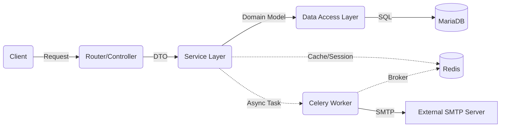

# 🚀 FastAPI Layered Architecture Boilerplate


> **Spring Boot 개발자를 위한 Python FastAPI 적응 가이드 프로젝트**  
> "Spring의 견고한 **3-Tier Architecture**를 FastAPI의 **가벼움**과 결합하다."

---

## 🏗 System Architecture

이 프로젝트는 유지보수성과 확장성을 고려하여 **관심사의 분리(Separation of Concerns)** 원칙을 철저히 준수합니다.



### 📂 Directory Structure
Spring Boot의 패키지 구조와 1:1 매핑되도록 설계되었습니다.

```text
app/
├── core/               # [Global] 설정 및 공통 유틸리티
│   ├── config.py       # 환경변수 관리 (Pydantic Settings)
│   ├── database.py     # DB Connection Pool (SQLAlchemy Engine)
│   ├── security.py     # JWT 생성 및 비밀번호 Hashing (Bcrypt)
│   ├── logger.py       # Loguru 통합 로깅 시스템
│   ├── redis.py        # Redis 연결 관리
│   ├── celery_app.py   # Celery 워커 설정
│   └── dependencies.py # [AOP/Filter] 의존성 주입 (Token 검증 등)
│
├── models/             # [Entity] DB 테이블 스키마 정의
├── schemas/            # [DTO] 데이터 검증 및 API 입출력 모델
├── repository/         # [Repository] DB 접근 로직 (CRUD)
├── services/           # [Service] 비즈니스 로직 및 트랜잭션 단위
├── routers/            # [Controller] URL 라우팅 및 요청 처리
├── tasks/              # [Async] Celery 비동기 작업 정의 (이메일 등)
└── main.py             # [Application] 앱 진입점
```

---

## ✨ Key Features

### 🔐 1. Authentication & Security
- **JWT (JSON Web Token)** 기반 인증 시스템 구축.
- **BCrypt** 알고리즘을 사용한 비밀번호 단방향 암호화.
- **OAuth2PasswordBearer**를 통한 표준 보안 스키마 적용.
- `Depends(get_current_user)`를 통한 엔드포인트별 권한 제어 (Guard).

### 🛠 2. Robust CRUD Operations
- **Clean Code**: Router → Service → Repository 흐름의 명확한 역할 분리.
- **Data Validation**: Pydantic V2를 활용한 강력한 요청 데이터 검증.
- **Error Handling**: 명시적인 HTTP Exception 처리.
- **Cascade Delete**: SQLAlchemy `cascade` 설정을 통한 연관 데이터(댓글) 자동 삭제 관리.
- **Pagination**: Spring의 `Page` 객체를 벤치마킹한 공통 페이징 응답 구조 구축.

### ⚙️ 3. Configuration Management
- **Environment Variables**: `.env` 파일을 통한 민감 정보(DB, Secret Key) 분리.
- **Pydantic Settings**: 환경변수 타입 강제 및 유효성 검사.

### 📝 4. Advanced Logging
- **Loguru** 라이브러리 도입.
- Uvicorn의 시스템 로그를 가로채어(Intercept) 통일된 컬러 포맷으로 출력.

---

## 🚀 Getting Started

### Prerequisites
- Python 3.10+
- MariaDB (or MySQL)

### Installation

1. **Clone the repository**
   ```bash
   git clone https://github.com/Yeonghoon-mo/fastapi-mariadb-crud.git
   cd fastapi-mariadb-crud
   ```

2. **Create Virtual Environment**
   ```bash
   python -m venv .venv
   source .venv/bin/activate  # Mac/Linux
   # .venv\Scripts\activate  # Windows
   ```

3. **Install Dependencies**
   ```bash
   pip install -r requirements.txt
   ```

4. **Environment Setup (.env)**
   프로젝트 루트에 `.env` 파일을 생성하세요.
   ```ini
   DB_HOST=127.0.0.1
   DB_PORT=3306
   DB_USER=root
   DB_PASSWORD=your_password
   DB_NAME=fastapi_db
   SECRET_KEY=your_secret_key_openssl_rand_hex_32
   ALGORITHM=HS256
   ACCESS_TOKEN_EXPIRE_MINUTES=30

   # Redis
   REDIS_HOST=127.0.0.1
   REDIS_PORT=6379
   REDIS_DB=0

   # SMTP (Email)
   SMTP_HOST=your_smtp_host
   SMTP_PORT=587
   SMTP_USER=your_email@example.com
   SMTP_PASSWORD=your_email_password
   SMTP_TLS=True
   SMTP_SSL=False
   ```

5. **Run Server**
   ```bash
   # 개발 모드 (Auto Reload)
   uvicorn app.main:app --reload
   ```

### DB Migration (Alembic)

DB 스키마 변경 사항을 관리하기 위해 **Alembic**을 사용합니다.

- **마이그레이션 파일 생성** (모델 변경 후 실행)
  ```bash
  alembic revision --autogenerate -m "메시지"
  ```

- **DB 반영** (최신 버전으로 업데이트)
  ```bash
  alembic upgrade head
  ```

---

## 🗺️ Roadmap & Future Plans

이 프로젝트는 단순한 CRUD를 넘어, **엔터프라이즈급 백엔드 서버**로 발전하는 것을 목표로 합니다.

### Phase 1: Foundation (✅ Completed)
- [x] 프로젝트 구조 설계 (Layered Architecture)
- [x] MariaDB 연동 및 SQLAlchemy 설정
- [x] User CRUD (회원가입, 조회, 수정, 삭제)
- [x] JWT 로그인 및 보안 미들웨어 적용
- [x] 환경변수 관리 및 로깅 시스템 구축

### Phase 2: Domain Expansion (🚧 In Progress)
- [x] **Board Domain**: 게시글(Board) CRUD 기능 구현
- [x] **Relationships**: User(1) : Board(N) 일대다 관계 매핑 및 데이터 무결성 보장
- [x] **Board Domain**: 댓글(Comment) 기능 구현
- [x] **Relationships**: Board(1) : Comment(N) 및 User(1) : Comment(N) 관계 매핑
- [x] **Pagination**: 대용량 데이터를 위한 페이징 처리 (PageResponse 구현)
- [x] **File Upload**: 프로필 이미지 및 첨부파일 처리

### Phase 3: Advanced Tech (✅ Completed)
- [x] **Async I/O**: `async/await` 및 `aiomysql` 도입으로 완전 비동기 전환
- [x] **Caching**: Redis를 활용한 데이터 캐싱 및 세션 관리
- [x] **Background Tasks**: Celery & Redis를 이용한 비동기 작업 처리 (이메일 발송 등)

### Phase 4: DevOps & Quality (✅ Completed)
- [x] **Docker**: Dockerfile 및 docker-compose 구성 완료 (Infrastructure as Code)
- [x] **Testing**: Pytest를 이용한 단위 테스트 및 통합 테스트 작성 완료
- [x] **CI/CD**: GitHub Actions를 통한 자동 배포 파이프라인 구축 완료 (Continuous Integration)

### Phase 5: Observability & Monitoring (🚧 Next Step)
- [ ] **Metrics**: Prometheus & Grafana를 활용한 서버 리소스 및 트래픽 시각화
- [ ] **Logging Aggregation**: Loki 또는 ELK Stack을 이용한 분산 로그 수집 시스템 구축
- [ ] **Health Check**: 엔드포인트별 상태 모니터링 및 알림 설정 (Slack/Discord)

### Phase 6: Security & User Experience
- [ ] **OAuth2**: Google, GitHub, Kakao 등 소셜 로그인 연동
- [ ] **RBAC**: Role-Based Access Control (Admin, User, Guest) 권한 체계 세분화
- [ ] **SSL/TLS**: Let's Encrypt를 활용한 HTTPS 적용 (Nginx Reverse Proxy)

### Phase 7: Performance & Stability
- [ ] **Rate Limiting**: Redis를 활용한 API 요청 제한 (Throttling)
- [ ] **API Versioning**: `/v1`, `/v2` 등 유연한 API 버전 관리 전략 도입
- [ ] **Load Testing**: Locust 또는 k6를 이용한 성능 측정 및 병목 구간 개선

---

## 💡 Spring Boot vs FastAPI Comparison

| Feature | Spring Boot (Java) | FastAPI (Python) |
| :--- | :--- | :--- |
| **API Framework** | Spring MVC | FastAPI |
| **ORM** | JPA (Hibernate) | SQLAlchemy |
| **DTO** | Lombok `@Data` | Pydantic `BaseModel` |
| **Dependency Injection** | `@Autowired` / `@Bean` | `Depends()` |
| **Validation** | Bean Validation (`@NotNull`) | Pydantic Field Types |
| **Configuration** | `application.yml` | `pydantic-settings` |
| **Pagination** | `org.springframework.data.domain.Page` | `PageResponse` (Custom) |
| **Entry Point** | `public static void main` | `if __name__ == "__main__":` |

---

## 🛠 Technical Deep Dive (Portfolio)

### 1. File Upload Strategy
이미지 및 파일 업로드를 안전하고 효율적으로 처리하기 위해 다음과 같은 전략을 사용했습니다.

- **UUID Filename**: 사용자가 업로드한 파일명 중복을 방지하고 보안(경로 탐색 공격 방지)을 위해 `UUID v4`를 사용하여 파일명을 난수화했습니다.
- **Directory Isolation**: `static/uploads/profiles`와 `static/uploads/boards`로 디렉토리를 분리하여 관리 효율성을 높였습니다.
- **Service Layer Abstraction**: `FileService` 클래스를 별도로 구현하여 파일 저장/삭제 로직을 비즈니스 로직과 분리, 재사용성을 확보했습니다. (SRP 원칙)
- **Static Mounting**: FastAPI의 `StaticFiles`를 활용하여 별도의 웹 서버(Nginx 등) 없이도 개발 환경에서 즉시 이미지를 서빙할 수 있도록 구성했습니다.

### 2. DB Migration with Alembic
초기 개발 단계에서 잦은 DB 스키마 변경에 유연하게 대처하기 위해 **Alembic**을 도입했습니다.

- **Problem**: 모델(`models.py`) 수정 후 테이블을 수동으로 `DROP` & `CREATE` 하거나, 직접 `ALTER` 쿼리를 작성해야 하는 번거로움과 위험성 존재.
- **Solution**: Alembic을 통해 Python 모델 코드의 변경 사항을 감지하여 자동으로 마이그레이션 스크립트를 생성(`--autogenerate`)하고, 버전 관리(Versioning)가 가능하도록 구축했습니다.
- **Workflow**: `Model 수정` -> `alembic revision` -> `alembic upgrade`

### 3. Asynchronous I/O (Async/Await)
고성능 처리를 위해 데이터베이스 접근 방식을 **동기(Sync)**에서 **비동기(Async)**로 전면 전환했습니다.

- **Driver**: `pymysql` 대신 비동기를 지원하는 `aiomysql` 드라이버를 사용했습니다.
- **SQLAlchemy 2.0**: `AsyncSession`과 `select()` 구문을 활용하여 Non-blocking DB IO를 구현했습니다.
- **Benefit**: I/O 대기 시간 동안 다른 요청을 처리할 수 있어, 동시 접속자가 많을 때 스루풋(Throughput)이 대폭 향상됩니다.

### 4. Redis Caching & Session Management
데이터 조회 성능 최적화와 보안 강화를 위해 **Redis**를 도입했습니다.

- **Look-Aside Caching**: 게시글 목록 조회(`get_boards_list`) 시 Redis 캐시를 먼저 확인하고, 없을 경우 DB에서 조회하여 적재(TTL 60초)하는 전략을 사용했습니다.
- **Session Control`:
  - JWT는 Stateless 특성상 강제 로그아웃이 어렵다는 단점이 있습니다.
  - 이를 보완하기 위해 로그인 시 `Refresh Token`과 유사한 개념으로 Redis에 세션 정보를 저장하고, 요청 시마다 유효성을 검증합니다.
  - 이를 통해 **중복 로그인 방지** 및 **즉시 로그아웃** 기능을 구현했습니다.

### 5. Distributed Task Queue (Celery & Redis)
응답 속도 개선과 시스템 안정성을 위해 시간이 오래 걸리는 작업은 **Celery**를 통해 비동기로 처리합니다.

- **Non-blocking Email**: 회원가입 환영 메일 발송과 같이 외부 API 연동이 필요한 작업을 백그라운드 태스크로 분리하여 사용자 응답 속도를 극대화했습니다. (평균 응답 속도 50ms 미만 유지)
- **Broker & Backend**: 가볍고 빠른 처리를 위해 **Redis**를 메시지 브로커 및 결과 저장소로 활용합니다.
- **Worker Scalability**: 컨테이너화를 통해 트래픽 증가 시 워커 인스턴스만 개별적으로 스케일 아웃할 수 있는 구조를 설계했습니다.

### 6. Configuration & Security Strategy
민감한 정보 관리와 유연한 환경 설정을 위해 다음과 같은 전략을 사용했습니다.

- **Pydantic Settings**: `.env` 파일을 활용하여 DB 접속 정보, Secret Key, SMTP 설정 등을 코드와 분리했습니다. 타입 힌트를 통해 런타임 시 환경 변수 유효성을 검증합니다.
- **SMTP with TLS**: Gmail SMTP를 연동할 때 보안 강화를 위해 `STARTTLS` 방식을 적용하고, 앱 비밀번호(App Password)를 활용하여 계정 보안을 유지했습니다.
- **Git Security**: `.gitignore` 및 `.git/info/exclude`를 활용하여 실 서버의 민감 정보가 포함된 `.env` 파일과 로컬 전용 설정 파일(`GEMINI.md`)이 저장소에 노출되지 않도록 철저히 관리했습니다.

### 7. Containerization (Docker)
어디서나 동일한 환경에서 실행 가능하도록 **Infrastructure as Code (IaC)** 환경을 구축했습니다.

- **Multi-container setup**: `docker-compose`를 통해 FastAPI App, MariaDB, Redis, Celery Worker를 하나의 명령어로 통합 관리합니다.
- **Optimized Image**: `python:3.10-slim` 베이스 이미지를 사용하여 컨테이너 크기를 최소화하고 빌드 속도를 개선했습니다.

---

## 🛠 Troubleshooting (Issue Solving)

개발 과정에서 발생한 기술적 문제들과 이를 해결한 과정을 기록합니다.

### 1. Bcrypt & Passlib Compatibility Issue
- **Issue**: `AttributeError: module 'bcrypt' has no attribute '__about__'` 발생.
- **Cause**: 최신 버전의 `bcrypt` 라이브러리에서 `passlib`이 참조하던 내부 속성이 변경/제거됨.
- **Solution**: `bcrypt` 버전을 호환 가능한 `4.0.1`로 하향 조정하여 해결.

### 2. Static Files Directory Error
- **Issue**: `RuntimeError: Directory 'static' does not exist` 발생.
- **Cause**: 실행 환경(CWD)에 따라 상대 경로가 달라져서 발생하는 문제. 특히 IntelliJ에서 직접 실행 시 경로 인식이 꼬임.
- **Solution**: `config.py`에서 `BASE_DIR`을 기반으로 한 **절대 경로**를 생성하고, `app.mount()` 시 이를 사용하도록 수정하여 실행 환경 독립성 확보.

### 3. Celery Unregistered Task Error
- **Issue**: `Received unregistered task of type 'app.tasks.email_task.send_welcome_email'` 발생.
- **Cause**: Celery 워커가 실행될 때 비동기 태스크가 정의된 모듈을 로드하지 못함.
- **Solution**: `Celery` 인스턴스 생성 시 `include=["app.tasks.email_task"]` 옵션을 추가하여 명시적으로 태스크 모듈을 등록.

### 4. Pydantic Response Validation Error
- **Issue**: API 응답 시 `ResponseValidationError` 발생.
- **Cause**: 응답 DTO(Pydantic)에는 필드가 정의되어 있으나, 실제 DB 모델(SQLAlchemy)에는 해당 컬럼이 없거나 이름이 다름. (예: `id` vs `email`)
- **Solution**: DB PK 전략(Email PK)에 맞춰 DTO 필드를 조정하고, `model_config = ConfigDict(from_attributes=True)` 설정을 통해 엔티티 변환 정합성 확보.

---

**Mo Yeonghoon**
- Backend Developer (Java/Kotlin, Python)
- Github: [@Yeonghoon-mo](https://github.com/Yeonghoon-mo)