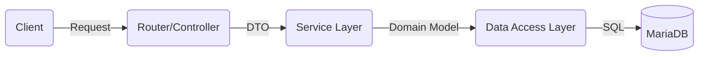

# 🚀 FastAPI Layered Architecture Boilerplate


> **Spring Boot 개발자를 위한 Python FastAPI 적응 가이드 프로젝트**  
> "Spring의 견고한 **3-Tier Architecture**를 FastAPI의 **가벼움**과 결합하다."

---

## 🏗 System Architecture

이 프로젝트는 유지보수성과 확장성을 고려하여 **관심사의 분리(Separation of Concerns)** 원칙을 철저히 준수합니다.



### 📂 Directory Structure
Spring Boot의 패키지 구조와 1:1 매핑되도록 설계되었습니다.

```text
app/
├── core/               # [Global] 설정 및 공통 유틸리티
│   ├── config.py       # 환경변수 관리 (Pydantic Settings)
│   ├── database.py     # DB Connection Pool (SQLAlchemy Engine)
│   ├── security.py     # JWT 생성 및 비밀번호 Hashing (Bcrypt)
│   ├── logger.py       # Loguru 통합 로깅 시스템
│   └── dependencies.py # [AOP/Filter] 의존성 주입 (Token 검증 등)
│
├── models/             # [Entity] DB 테이블 스키마 정의
├── schemas/            # [DTO] 데이터 검증 및 API 입출력 모델
├── repository/         # [Repository] DB 접근 로직 (CRUD)
├── services/           # [Service] 비즈니스 로직 및 트랜잭션 단위
├── routers/            # [Controller] URL 라우팅 및 요청 처리
└── main.py             # [Application] 앱 진입점
```

---

## ✨ Key Features

### 🔐 1. Authentication & Security
- **JWT (JSON Web Token)** 기반 인증 시스템 구축.
- **BCrypt** 알고리즘을 사용한 비밀번호 단방향 암호화.
- **OAuth2PasswordBearer**를 통한 표준 보안 스키마 적용.
- `Depends(get_current_user)`를 통한 엔드포인트별 권한 제어 (Guard).

### 🛠 2. Robust CRUD Operations
- **Clean Code**: Router → Service → Repository 흐름의 명확한 역할 분리.
- **Data Validation**: Pydantic V2를 활용한 강력한 요청 데이터 검증.
- **Error Handling**: 명시적인 HTTP Exception 처리.

### ⚙️ 3. Configuration Management
- **Environment Variables**: `.env` 파일을 통한 민감 정보(DB, Secret Key) 분리.
- **Pydantic Settings**: 환경변수 타입 강제 및 유효성 검사.

### 📝 4. Advanced Logging
- **Loguru** 라이브러리 도입.
- Uvicorn의 시스템 로그를 가로채어(Intercept) 통일된 컬러 포맷으로 출력.

---

## 🚀 Getting Started

### Prerequisites
- Python 3.10+
- MariaDB (or MySQL)

### Installation

1. **Clone the repository**
   ```bash
   git clone https://github.com/Yeonghoon-mo/fastapi-mariadb-crud.git
   cd fastapi-mariadb-crud
   ```

2. **Create Virtual Environment**
   ```bash
   python -m venv .venv
   source .venv/bin/activate  # Mac/Linux
   # .venv\Scripts\activate  # Windows
   ```

3. **Install Dependencies**
   ```bash
   pip install -r requirements.txt
   ```

4. **Environment Setup (.env)**
   프로젝트 루트에 `.env` 파일을 생성하세요.
   ```ini
   DB_HOST=127.0.0.1
   DB_PORT=3306
   DB_USER=root
   DB_PASSWORD=your_password
   DB_NAME=fastapi_db
   SECRET_KEY=your_secret_key_openssl_rand_hex_32
   ALGORITHM=HS256
   ACCESS_TOKEN_EXPIRE_MINUTES=30
   ```

5. **Run Server**
   ```bash
   # 개발 모드 (Auto Reload)
   uvicorn app.main:app --reload
   ```

---

## 🗺️ Roadmap & Future Plans

이 프로젝트는 단순한 CRUD를 넘어, **엔터프라이즈급 백엔드 서버**로 발전하는 것을 목표로 합니다.

### Phase 1: Foundation (✅ Completed)
- [x] 프로젝트 구조 설계 (Layered Architecture)
- [x] MariaDB 연동 및 SQLAlchemy 설정
- [x] User CRUD (회원가입, 조회, 수정, 삭제)
- [x] JWT 로그인 및 보안 미들웨어 적용
- [x] 환경변수 관리 및 로깅 시스템 구축

### Phase 2: Domain Expansion (🚧 In Progress)
- [x] **Board Domain**: 게시글(Post) CRUD 기능 구현
- [x] **Relationships**: User(1) : Post(N) 일대다 관계 매핑 및 데이터 무결성 보장
- [ ] **Board Domain**: 댓글(Comment) 기능 구현
- [ ] **Relationships**: Post(1) : Comment(N) 관계 매핑
- [ ] **Pagination**: 대용량 데이터를 위한 페이징 처리
- [ ] **File Upload**: 프로필 이미지 및 첨부파일 처리

### Phase 3: Advanced Tech
- [ ] **Async I/O**: `async/await` 및 `aiomysql` 도입으로 완전 비동기 전환
- [ ] **Caching**: Redis를 활용한 데이터 캐싱 및 세션 관리
- [ ] **Background Tasks**: Celery 또는 RabbitMQ를 이용한 비동기 작업 처리 (이메일 발송 등)

### Phase 4: DevOps & Quality
- [ ] **Testing**: Pytest를 이용한 단위 테스트 및 통합 테스트 작성
- [ ] **Docker**: Dockerfile 및 docker-compose 구성
- [ ] **CI/CD**: GitHub Actions를 통한 자동 배포 파이프라인 구축

---

## 💡 Spring Boot vs FastAPI Comparison

| Feature | Spring Boot (Java) | FastAPI (Python) |
| :--- | :--- | :--- |
| **API Framework** | Spring MVC | FastAPI |
| **ORM** | JPA (Hibernate) | SQLAlchemy |
| **DTO** | Lombok `@Data` | Pydantic `BaseModel` |
| **Dependency Injection** | `@Autowired` / `@Bean` | `Depends()` |
| **Validation** | Bean Validation (`@NotNull`) | Pydantic Field Types |
| **Configuration** | `application.yml` | `pydantic-settings` |
| **Entry Point** | `public static void main` | `if __name__ == "__main__":` |

---

## 👨‍💻 Maintainer

**Mo Yeonghoon**
- Backend Developer (Java/Kotlin, Python)
- Github: [@Yeonghoon-mo](https://github.com/Yeonghoon-mo)